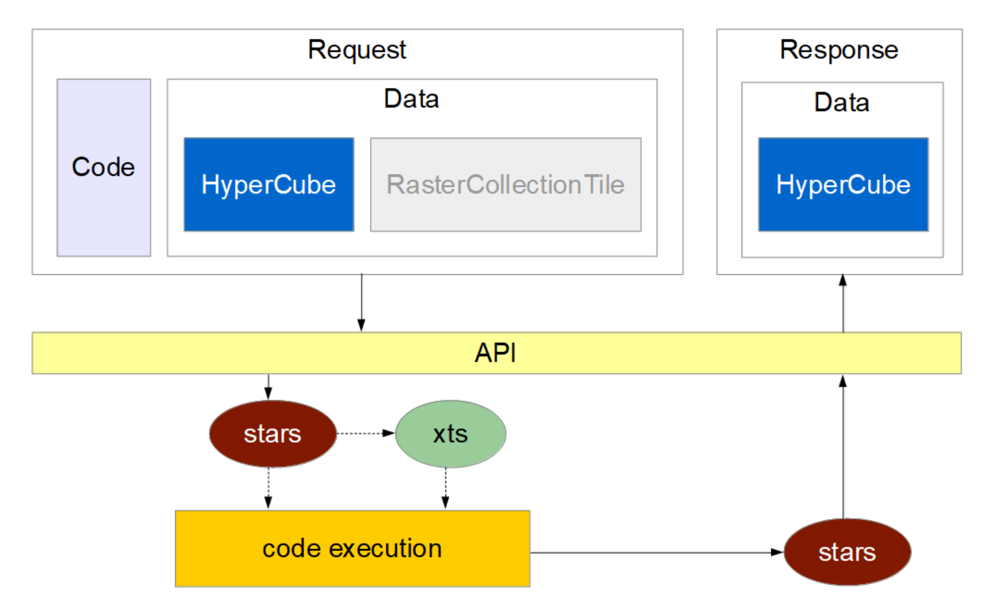

```{r setup, include=FALSE}
knitr::opts_chunk$set(echo = TRUE)
```

## Getting started with R UDF

Usually the R UDF is a component within an openEO back-end infrastructure, mainly due to securtiy concerns. It will be called within the `run_udf` process and users won't be exposed to the UDF API and the managed data exchange between the process chain of the back-end and the UDF service.

However, it seems wise to offer a way to setup a local UDF server first in order to test the code or get familiar with the mechanisms. 

## What is the R-UDF service

As described in the [openEO UDF framework](https://open-eo.github.io/openeo-udf/) the service is designed to run user defined functions in Python and R on the data of a user defined process (former process graph). R and Python services are developed respectively. When we talk about **service**, means a stateless webservice - often HTTP webservice. The service receives the preprocessed data and the users script from the openEO back-end and executes the code on the data in a separated environment and returns the result.

The exchange of data is defined in the [UDF API](https://open-eo.github.io/openeo-udf/api_docs/). In the current API (new API version available in late January 2020) we have defined an HTTP endpoint `POST /udf` to handle the UDF execution as well as endpoints related to setting up machine learning models across different UDF services. The R-UDF currently only supports the UDF execution and offers an additional endpoint to receive a list of installed R packages with their version.

The Python UDF service also offers Python bindings, allowing Python back-ends to run Python code directly by transforming Python objects like `xarray`, `numpy` and other into the common data formats. This only works if your back-end is implemented in Python and if you call an internal process in order to share the in-memory objects. This is not supported in the R-UDF service, because no back-end is implemented in R to pass on memory objects. This is the reason why this service will be offered as externalized / stand-alone service, which requires a data serialization into a common data format for in- and output, which makes it potentially slower in execution than its Python in-process called counterpart.

## Technology and workflow

The HTTP requests are handled by [`plumber`](https://www.rplumber.io/) which is an HTTP webservice for R. The request is decomposed into data and code. The code will be wrapped into a function which signature will be customizable with the `@require` annotation which will be discussed later. The data is translated into a [`stars`](https://r-spatial.github.io/stars/) object by default. The user can also choose if the incoming object will be a `xts` or a `stars` object with the same `@require` annotation.
Then the user code is invoked by calling the produced function and the results are transformed into a `stars` object and translated into the respective API data model (currently only HyperCubes are created and supported).



## Endpoints
The R UDF service contains several endpoints. Besides the mandatory `POST /udf`, there are the endpoints `GET /` (information about the service, versions) and `/packages` (installed R packages). The latter are only for information purposes, which might be of interest for an openEO back-end hosting this service.

## Type Conversion
The object type conversions are a crucial part. It defines with which R objects the user can work within their code. Apart from the default `stars` object, `xts`, `data.frame`/`tibble`, `list` and basic R types are currently supported. This means that a user can `require` certain types to work with and in the R UDF service the incoming UDF-API defined data object is translated into the corresponding R object.
Similarly the output formats of the UDF code fragment are certain supported R objects (`stars`, `xts`, `list`, `data.frame`, `matrix` and various `vector` types). This requires the user to return one of the afore mentioned objects at the end of their code fragment.

From a users perspective that uses one of the openEO client software the UDF-API data types should not matter much. The UDF user only needs to take care of the "requiring" of data using the `@require` annotation. The openEO back-end chooses the most appropriate way to pass data on to the UDF service. Normally there is only one useful choice from within the processes context. For example `DataCube` objects in the process graph context are HyperCube objects and hence it will be translated into a `stars` object. In other cases, when we reduce the "time" dimension, then the user should operate on timeseries objects like `xts`. Simple data types might come into play, when you define a custom "apply" function or as a return type in custom dimension reduce functions.

So, in order to help understanding the variaty of input objects into the code, the following to chapters and tables show the object mappings from UDF-API objects into the corresponding R objects.

### Input
|UDF-API Data Class|Require Type|R Representation|Comment|
|-|-|-|-|
|StructuredData::dict|list|list||
|StructuredData::list|numeric|numeric vector||
|StructuredData::list|integer|integer vector||
|StructuredData::list|character|character vector||
|StructuredData::list|factor|factor vector||
|StructuredData::list|logical|logical vector||
|StructuredData|matrix|matrix|all elements need to be of the same type|
|StructuredData::table|data.frame|data.frame||
|StructuredData::table|tibble|tibble||
|HyperCube|stars|stars|default|
|HyperCube|xts|xts|done via mapping to stars first|

### Output
|R Representation|UDF-API Data Class|Comment|
|-|-|-|
|named list|StructuredData::dict||
|unnamed list|StructuredData::list|data types have to be the same (like a vector object)|
|named vector|StructuredData::dict||
|numeric vector|StructuredData::list||
|integer vector|StructuredData::list||
|character vector|StructuredData::list||
|factor vector|StructuredData::list||
|logical vector|StructuredData::list||
|matrix|StructuredData||
|data.frame|StructuredData::table||
|tibble|StructuredData::table||
|stars|HyperCube|default|
|xts|HyperCube|first xts to stars and then into hypercube|

## UDF scripting

The data is injected into the code via the variable `data`. `data` contains either a `stars` or a `xts` object based on the presence of the require annotation. By default the variable is called `data` and is a `stars` object.

For multidimensional data the dimensions are labeled with some fixed names. For the spatial it is **x** and **y**, for the temporal dimension **t** and for bands or layers it is **band**. This means that if you need to address a particular dimension you can reference them by name rather than relying on the dimension order. The real dimensionality may vary based on the prior used back-end functions.

To develop your own script you might create some example data by creating a similarly shaped `stars` object or a `xts` object. How to create such example data please look into the respective R packages and their vignettes.

```{r, eval=FALSE}
# @require x:stars

all_dim = names(dim(x))
ndvi_result = st_apply(x, FUN = function(X,...) {
  (X[8]-X[4])/(X[8]+X[4])
}, MARGIN = all_dim[-which(all_dim=="band")])

all_dim = names(dim(ndvi_result))
min_ndvi = st_apply(ndvi_result,FUN = min, MARGIN = all_dim[-which(all_dim=="t")])

min_ndvi
```

The example above calculate the minimum Normalized difference index (NDVI) on a Sentinel-2 dataset. With the comment at the beginning you can define the variable the code works on. In the example **@require** triggers the customization of the input data. The colon (**:**) defines the data assignment. Left of the colon is the data object name and on the right side there is the class name. Currently only `stars` and `xts` are allowed values for the classes.

Everything afterwards are calls to manipulate the object. And at the end of the script the return value is specified.

In the internal UDF execution of this service the code will be translated into the following function which is invoked:

```{r, eval=FALSE}
function(x) {
  all_dim = names(dim(x))
  ndvi_result = st_apply(x, FUN = function(X,...) {
    (X[8]-X[4])/(X[8]+X[4])
  }, MARGIN = all_dim[-which(all_dim=="band")])
  
  all_dim = names(dim(ndvi_result))
  min_ndvi = st_apply(ndvi_result,FUN = min, MARGIN = all_dim[-which(all_dim=="t")])
  
  min_ndvi
}
```

For the development: Create test data with the same shape of the intended data (where you want to invoke `run_udf`) and manipulate the data as intended. To port it into an UDF script, copy the manipulation steps into a separate file and specify the input data via the annotation.
In the future creating test data might be supported by the openEO back-ends or clients.

## Examples

### Prerequisite
You need to have a running UDF service instance. Either via RStudio and its integrated plumber API support. Or you can run the service by creating a container from the Docker image.
You have cloned the repository or downloaded the JSON files and this file in `/examples`.
To run the UDF service instance locally start a rstudio session and do this
```
library(plumber)
r_udf = plumb(api.R)
r_udf$run(port=5555)
```
To connect to the api open a second instance of rstudio and get for example the installed packages.
```
library(httr)
library(jsonlite)
pkg = GET("http://127.0.0.1:5555/packages")
pkg = fromJSON(content(pkg, "text")
```


### Example Data
The example data (`/examples/data/hypercube.json`) is a Sentinel-2 L1C subset for 3 timesteps, 13 bands and 300 x 300 pixel spatial resolution. The single bands are upscaled to the highest available resolution applying nearest neighbor interpolation. This scene is provided as plain text JSON files as `RasterCollectionTile` and `Hypercube`. The current data models can be viewed [here (Version 0.1pre-alpha)](https://open-eo.github.io/openeo-udf/api_docs/).

### UDF testing example

With the function `send_udf` you can upload a payload to the UDF service by specifying `host`, `port`, `code` and `data`. If you are not interested in benchmarking you can leave `debug` and `download_info` with the default values. The latter two parameters return the time taken for the complete UDF request (debug) and the time for downloading the result data set.

You can pass either the path to the json file containing the data (e.g. one of the provided files) or you can pass a already imported JSON file (e.g. the result after using `jsonlite::read_json`). The code shall be provided as a quoted command block. To develop the UDF script you need to know that the variable `data` is provided as a `stars` object - always. Internally in the UDF service, a function is build with the parameter `data` and the body of that function is then replaced with the provided code. The result of the script needs to be one of the above mentioned objects.

If you want to use an annotation for customizing the input data type or the variable name, you need to write the script in a file and don't use the `quote()` function. The quotation function removes comments from the code, which will lead to undesired behavior in the R UDF service.

```{r, eval=FALSE}
script = quote({
  all_dim = names(dim(data))
  ndvi_result = st_apply(data, FUN = function(X,...) {
    (X[8]-X[4])/(X[8]+X[4])
  }, MARGIN = all_dim[-which(all_dim=="band")])
  
  all_dim = names(dim(ndvi_result))
  min_ndvi = st_apply(ndvi_result,FUN = min, MARGIN = all_dim[-which(all_dim=="t")])

  min_ndvi
})
```

The script is merely an example and can be optimized. It calculates the minimum NDVI over the given data set.

```{r,  eval=FALSE}
library(openeo)
port = 5555 
host = "http://localhost"
result_with_cube = jsonlite::fromJSON(send_udf(data = "examples/data/hypercube.json",code = script,host=host,port=port),simplifyVector = TRUE)
```

The result of the run_udf is a JSON string that can be translated into an R object. The type of the object is a `HyperCube`.


### Additional examples / data

Under the folder `/examples` of this repository there are different folders containing JSON objects for example data, some R scripts operating on different data, as well as the payloads of combined data and code fragments for processing.

### Debugging 
You need a locally running UDF service instance started via plumber in rstudio. And a second rstudio session which is used to send requests to the locally running UDF service. This is described in [Prerequisits](#prerequisite). Furthermore, add `browser()` to the your R UDF script.

```{r, eval=FALSE}
script = quote({
  browser()
  all_dim = names(dim(data))
  ndvi_result = st_apply(data, FUN = function(X,...) {
    (X[8]-X[4])/(X[8]+X[4])
  }, MARGIN = all_dim[-which(all_dim=="band")])
  
  all_dim = names(dim(ndvi_result))
  min_ndvi = st_apply(ndvi_result,FUN = min, MARGIN = all_dim[-which(all_dim=="t")])

  min_ndvi
})
```
Then use `send_udf()` as described above. Make sure that `browser()` is included in the file you pass to the argument `code = `.
```{r, eval=FALSE}
send_udf(data = "examples/data/hypercube.json",code = script,host=host,port=port)
```
You will now be in the debug-mode of your locally running UDF service instance. And can evaluate interactively through your R UDF code.
**Note for backend developers hosting a R UDF service:**
This debug method is the only way to see what is happening inside the R session of the docker container used for your R UDF service. If the R UDF service you are hosting returns a 500 error you will most likely use this debug method. 
If you are concerned about how the data transfer from the openEO backend into the R UDF service works (i.e. the conversion of the hypercube.json written by the backend into the stars object used by the R UDF servie) you can `httr::POST()` the hypbercube.json containing data and code. An example of this hypercube.json file is in this repo `examples/request/minimal_example_with_code.json`. Make sure to add `browse()` into the code section of this request. Then you can debug like this.
```{r, eval=FALSE}
httr::POST(url = "http://127.0.0.1:5555/udf", body = "examples/request/minimal_example_with_code.json")
```
